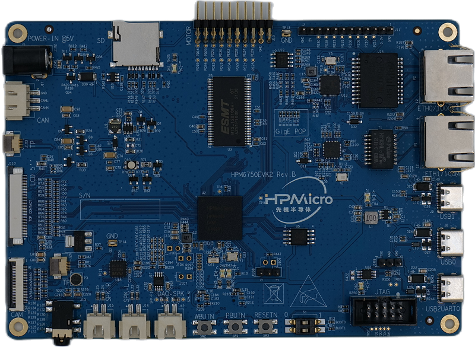

# device_board_hpmicro

- [简介](#简介)
- [开发板规格](#开发板规格)
- [openharmony关键特性](#openharmony关键特性)
- [相关仓库](#相关仓库)
- [联系](#联系)

## 简介
HPM6750EVK2提供了HPM6750微控制器大部分外设的接口，包括1个复位按键，2个通用按键, 1个RGB三色LED，板载usb转uart接口，摄像头接口，1个SD卡槽，2个USB Type-C接口，1个千兆网口、一个百兆网口，CAN FD接口，音频接口等，并扩展了NOR Flash，SDRAM等外接存储器。如果有兴趣了解更多相关信息，可以在 [先楫主页](http://www.hpmicro.com/resources/resources.html) 中进行浏览。

开发板视图如下：

## 开发板规格

| 器件类别     |              开发板              |
| ---------- | -------------------------------- |
| CPU        | HPM6750, RISC-V (Max: 816MHz) |
| RAM        | 2048KB SRAM |
| SDRAM      | 32M
| Flash      | 16MB SPI Flash |
| Ethernet0  | 千兆 |
| Ethernet1  | 百兆 |
| USB        | 2路高速OTG-USB |
| CAN FD     | 1路 |

## OpenHarmony关键特性

| 组件名       | 能力介绍                                                                                       |
| -------------- | ------------------------------------------------------------------------------------------------ |
| 内核         | LiteOS-M                                                                                        |
| 上电启动     | 上电启动OpenHarmony                                                                          |
| 外设控制     | 提供操作外设的能力，包括：I2C、UART、SPI、GPIO、FLASH等。                      |
| 系统服务管理 | 系统服务管理基于面向服务的架构，提供了OpenHarmony统一化的系统服务开发框架。                  |
| 启动引导     | 提供系统服务的启动入口标识。在系统服务管理启动时，调用boostrap标识的入口函数，并启动系统服务。 |
| 系统属性     | 提供获取与设置系统属性的能力。                                                                   |
| 基础库       | 提供公共基础库能力，包括：文件操作。                                                      |
| 网络       | 提供Lwip协议栈适配，支持双路以太网。                                                      |
| DFX          | 提供DFX能力，包括：流水日志等。                                                     |
| HDF           | 提供OpenHarmony硬件配置驱动的能力。                                                         |
| XTS          | 提供OpenHarmony生态认证测试套件的集合能力。                                                    |

## 相关仓库

[vendor_hpmicro](https://gitee.com/openharmony-sig/vendor_hpmicro)

[device_soc_hpmicro](https://gitee.com/openharmony-sig/device_soc_hpmicro)

[device_board_hpmicro](https://gitee.com/openharmony-sig/device_board_hpmicro)

## 联系

如果您在开发过程中有问题，请在仓库[issues](https://gitee.com/openharmony-sig/device_board_hpmicro/issues)提问。